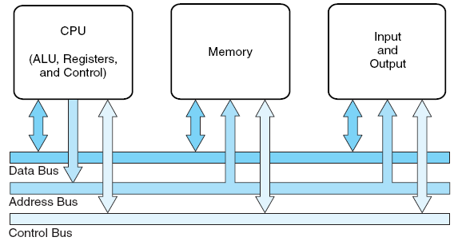

# Lecture 1: What is a Computer

## Definition of Computer

- A modern computer is an **electronic, digital, general purpose** computing machine that automatically follows a **step-by-step list of instructions** for solving a problem.
- This step-by-step list of instructions taht a computer follows is also called a **computer program**.

## The Turing Machine

_Abstract model of all computers_

A Turing Machine Consists of:

- A **type** divided into cells;
- A **moving read / write head**
- A **state register** storing the state of the Turing Machine
- A **finite table of instruction** specifying what the machine does when reading the content of the current cell:
  - Move left / right;
  - Erase / write a symbol;
  - Change the state.

## The Church-Turing Thesis

**All things that can be computed can be computed by a Turing Machine.**

## Universal Turing Machine (**UTM**)

Turing described a Turing machine that **could simulate all other Turing machines**:

- Inputs: Data + A description of computation (Turing machine)
- **Programmable**
- _**A computer is a Universal Turing Machine**_

## The von Neumann Architecture

- aka **stored-program architecture**
- Both data and program are stored in the memory

### The stored-program architecture

- **CPU**
  - Control Unit
  - Arithmetic Logic Unit (**ALU**)
  - Registers
- Main Memory
- I/O System
- A single path between the main memory and CPU, called the [**von Neumann bottleneck**](#the-von-neumann-bottleneck)

### Von Neumann Execution Cycle

- aka **fetch-decode-execute** cycle
  - The control unit **fetch the next instruction** from the memory
  - The instruction is **decoded** into a language that the ALU understands
  - **Data operands are fetched** from the memory into the registers inside CPU
  - The ALU **executes** the instruction and places the result into the registers or memory

### The von Neumann Bottleneck

- CPU and memory are separate
- All data and code are in the memory
- CPU is usually faster than memory
- CPU is forced to wait for needed data to be transferred to or from memory

### The System Bus Model

## Abstraction

The process of forming a concept by identifying _common features_ among a group of individuals, or by _ignoring spatio-temporal(时空) aspects_ of these individuals.
