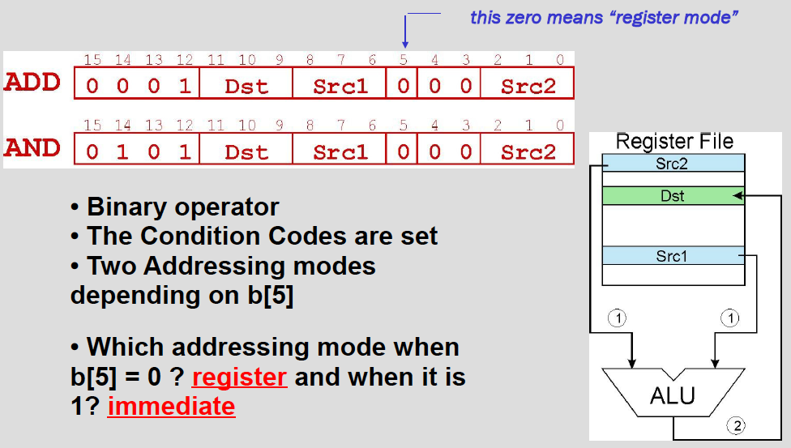

# The LC-3 ISA

The ISA specifies all the information about the computer that the software has to know.

- Memory
  - Address space (how many locations?)
  - Addressability (word or byte, word size)
- Registers
  - Number (how many?)
  - Type
- Instructions
  - Operations
  - Data types
  - Addressing modes

## Memory Organization

## Data Types

2's Complement

## Registers

- **8 GPRs (General Purpose Registers)**: R0 - R7, each 16 bits
- **MAR, MDR**
- **PC, IR**
- Condition Codes: **P, Z, N**
- **KBDR, KBSR** (KeyBoard), **DDR, DSR** (Display)

### Condition Codes

- 3 single bit **registers** (set to 1 or cleared to 0)
  - **N**: when value written was **negative**
  - **Z**: when value written was **zero**
  - **P**: when value written was **positive**
- Affected each time any register is written
- Condition codes are read by conditional branch instructions

## Addressing Modes

- **Immediate** (in the insn itself)
- In a **Register**
- In **Memory**
  - **PC-Relative**: Addr = PC + Offset
  - **Base + Offset**: Addr = BaseReg + Offset
  - **Indirect**: _Address of a location contains the address of the operand_

## Instructions

- 3 Operate Instructions:
  - **ADD** (0001)
  - **AND** (0101)
  - **NOT** (1001)
- 7 Data MOvement Instructions:
  - **LD** (0010)
  - **LDI** (1010)
  - **LDR** (0110)
  - **LEA** (1110)
  - **ST** (0011)
  - **STI** (1011)
  - **STR** (0111)
- 5 Control Instructions
  - **BR** (0000)
  - **JMP / RET** (1100)
  - **JSR / JSSR** (0100)
  - **RTI** (0111)
  - **TRAP** (1111)

### ADD / AND

#### Register Mode

- **Bit 5 = 0**
- Reg_Dst = Reg_Src1 + Reg_Src2

#### Immediate Mode

- **Bit 5 = 1**
- Reg_Dst = Reg_Src1 + **Imm5**

<!--

### LDR

- **Move [Base + Offset] to Dst**
- Load memory content at address (R3 + 6) to R2:

### JMPR

- Set **PC** to the value obtained by adding an offset to a register.
- PC = R3 + 6:

-->
